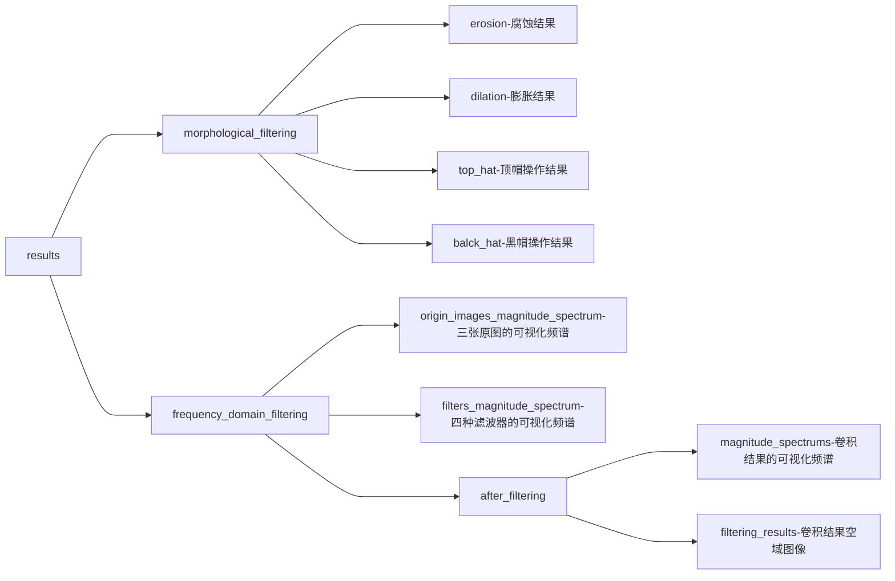

# 贾林轩 1853688 滤波作业Ⅱ（形态学滤波&频域滤波）
## 一. 运行环境
### 1. 硬件信息
GPU：NVIDIA GeForce GTX 1660 Ti with Max-Q Design 
CPU：Intel(R) Core(TM) i7-9750H CPU @ 2.60GHz
RAM：16GB；
OS：WindowsPE 64bit Version：Windows-10-10.0.19043-SP0

### 2. 软件环境
IDE：pycharm
python Version：3.9.7
software packages：cv2, numpy, os, copy, matplotlib.pyplot（用于展示图像）
.md阅读器：typora

## 二. 文件结构
1. morphological_filtering.py：形态学滤波的有关代码（结果储存在/results/morphological_filtering/中）

2. frequency_domain_filtering.py：频域滤波的有关代码（结果储存在/results/frequency_domain_filtering/中）

3. source_images: 存放三张原图

4. results: 储存结果图像

(以下代码如无法运行可在源文件夹中查看“**results文件结构.png**”)

